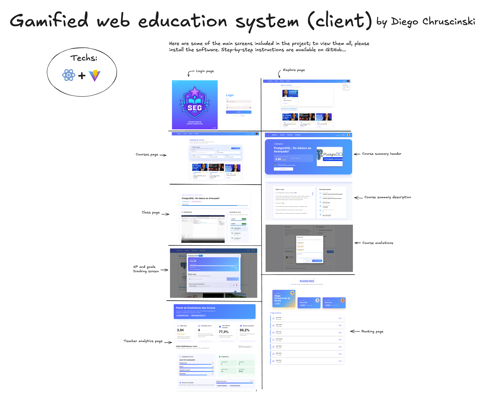

# Gamified web education system (client)

Frontend for my undergraduate capstone project (TCC): a web-based learning platform with **gamification**, designed to increase engagement and improve progress tracking through **XP**, **challenges**, **goals**, **badges**, and **ranking**. This work was approved by the evaluation committee with an average score of **9.9/10**.

---

## Overview

<p align="center">
  
</p>

This project is the **web client** of the platform. It consumes the backend **REST API** and provides a modern UI for:

- User **authentication** (login)
- Course discovery and **enrollment**
- Lesson/class experience with **progress tracking**
- Gamification features (XP, goals, challenges, badges, ranking)
- Teacher/admin-style views (analytics and course insights)

---

## Context & value

Many learning platforms struggle with **low retention** and inconsistent study routines.  
This frontend was designed to make learning feel more engaging by:

- keeping goals and progress visible (**XP + per-lesson tracking**),
- encouraging consistency (**goals and challenges**),
- increasing motivation (**badges and ranking**),
- presenting course insights clearly (**evaluations and analytics**),
- delivering a clean and responsive UI with a component-based approach.

---

## Key screens & features

### 🔐 Authentication
- Login flow integrated with the backend API
- User session handling (as implemented in the project)

### 🔎 Course discovery
- Explore/catalog page to browse available courses
- Courses listing with navigation to course details

### 📘 Course summary
- Course header summary (key information and call-to-action)
- Course description section with structured content

### 🎬 Class / lesson experience
- Lesson view focused on learning progression
- Progress indicators tied to the backend tracking rules

### ⭐ Evaluations
- Course evaluations modal/section
- UI support for collecting and viewing course feedback

### 🕹️ Gamification
- XP and goals tracking screen
- Visual progression elements aligned with the platform rules

### 🏆 Ranking
- Ranking page showing user position and leaderboard view

### 📊 Teacher analytics
- Course analytics dashboard screen
- Metrics and insights UI for tracking performance and course engagement

---

## Tech stack

### Core
- **TypeScript**
- **React**
- **Vite**

### UI
- **Material UI (MUI)**

### Additional
- API integration via **HTTP requests** to the backend REST API
- Component-based architecture and screen routing (as implemented)

---

## 🚀 Install & run (Node.js required)

```bash
# 1) Clone and enter the project
git clone https://github.com/chruscinskiDiego/gamified-web-education-system-client
cd gamified-web-education-system-client
````

```bash
# 2) Install dependencies
npm install
```

```bash
# 3) Create .env
cat > .env << 'EOF'
VITE_API_URL=YOUR_BACKEND_URL
EOF
```

```bash
# 4) Run the app (development)
npm run dev
```
